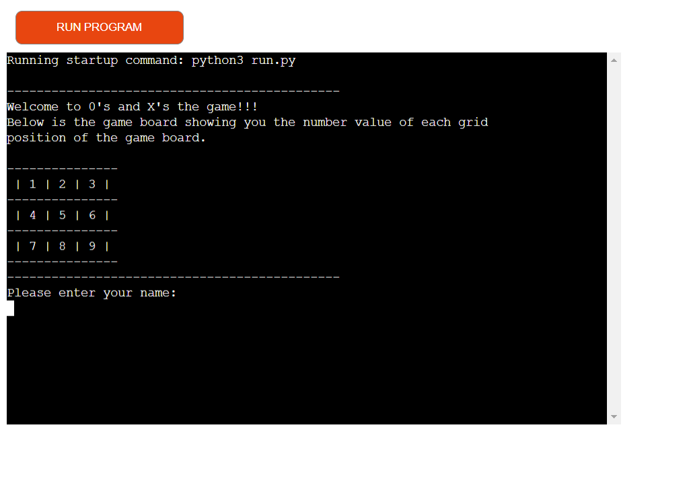
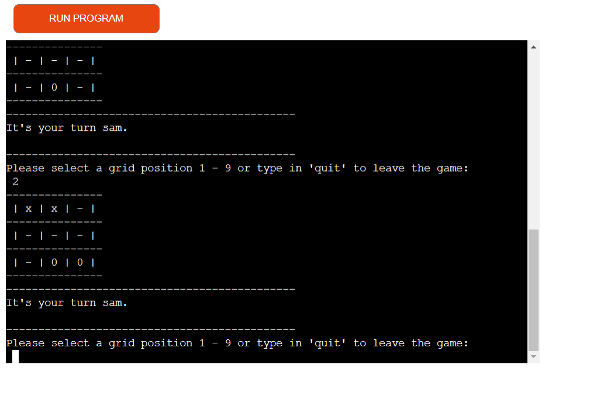
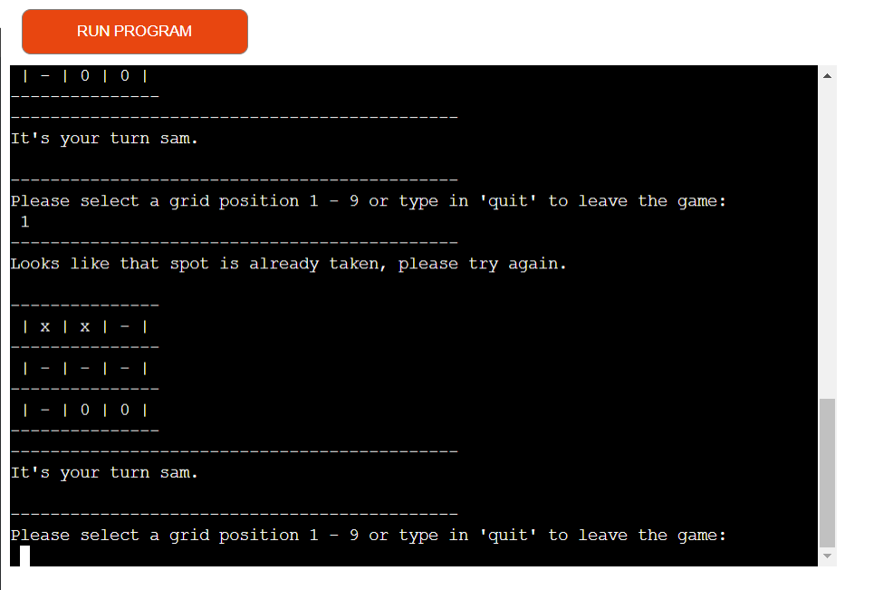
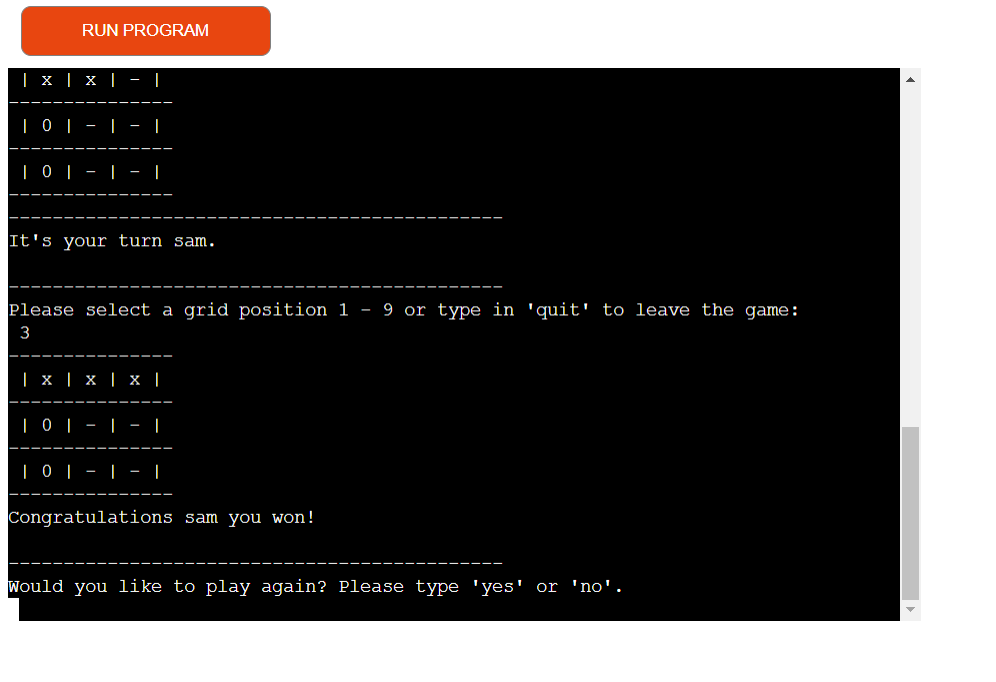
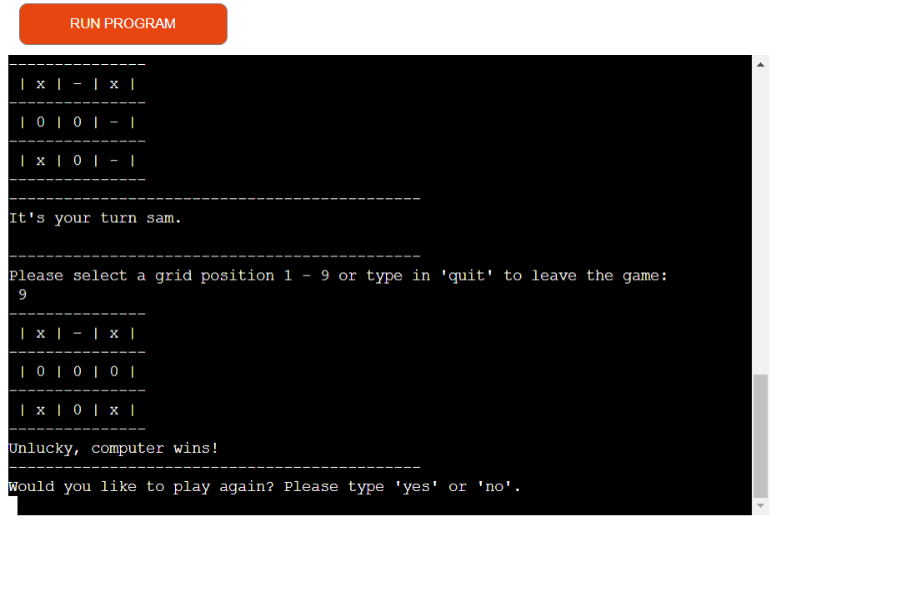
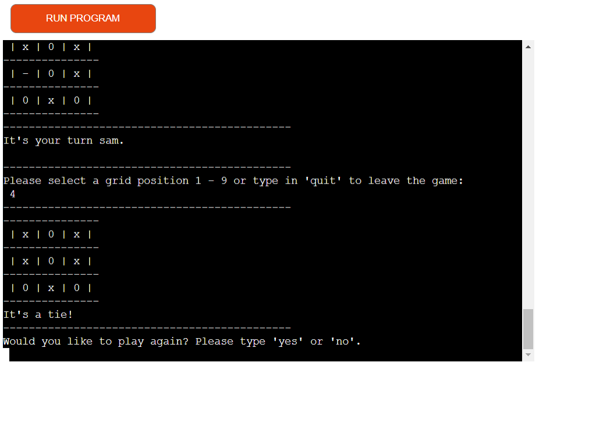

# 0's and X's the game!
0's and X's is a Python terminal game, which runs in the Code Institute mock terminal on Heroku.

Users can try to beat the computer by connnecting three X's in a line whether it be in the same row, column or diagonal before computer does with 0's. Take it in turns to select your positions on the grid.

Here is a live version of my project:
https://the-0-and-x-game-643188cf49a3.herokuapp.com/

## Contents

* [How To Play](#how-to-play)
* [Design](#deign)
* [Fetaures](#features)
* [Technologies Used](#technologies-used)
* [Deployment](#deployment)
* [Testing](#testing)
* [Credits](#credits)

## How To Play

The game is played on a grid that's 3 squares by 3 squares. You are X and the computer is 0. Players will take turns putting their marks in empty squares. The first player to get 3 of their marks in a row, column or diagonally is the winner.

The user will first enter there name before starting the game. The user will then be asked to select a number between 1 and 9 as to where they would like to position there marker on the grid. The square in the top left corner will be the value of one, the squares will go up in order from left to right and then down to the next row.

Once the user selects a grid position the computer will then select a random grid position, this will continue until there has been a declared winner or a tie.

User must select a number between 1 and 9 and once that has not been selected previously by the user or computer.

## Design

To help me design and creat the code for this game, I built a flow chart to help understand how I wanted the game to work and what i needed to do to make the game work.

## Features

When you first load the game, a welcome message is displayed along with information stating the value of the square in the top left of the grid.
The user will also be asked to enter there name.

Once the user has entered there name, another welcome message will appear and print out the game board.

The console will inform the user that its there turn and ask them to select a grid positon between 1 and 9. This must be a whole number between 1 and 9 entered as an integer.

Once the player has selected a position on the grid an 'x' will appear in that position. The computer will automatically will then take its turn and position a '0' randomly on the grid.

The player will then be informed that its there turn again and asked to select another position on the grid by enetering a value between 1 and 9.
This again must a whole number between 1 and 9 as an integer but cannot be a positon already taken up by an 'x' or a '0' on the grid.

If the player selects a grid position that is already been taken up by an 'x' or a '0' they will be informed that that position has already been taken and to try again.

If the player try's to enter a number thats not between 1 and 9, they will be informed that they have entered an invalid number and to try again with a number between 1 and 9.

If the player try's to enter text instead of a number, they will be informed that the number is invalid, with an error message and to try again.

If the player is the first connect three in a row, column or diagonally the game will stop. A congratualtions message will appear and the user will be asked if they would like to play again. To play again the user ust type in 'yes' and the game will return to the original start. If anything else is typed in the game will be ended.

If the player decides not tp play again, a thanks for playing mesage will be displayed and the program will stop running.

The game can also end with the computer being first to connect three in a row, column or diagonally. When this occurs an unlucky message will appear and the user will be asked if they would like to play again.

The game can also end in a tie, in this scenario the game will be stopped, a message will appear informing the player that its a tie and then given the option if they would like to play again.

## Technologies Used

### Languages Used

- Python was used to create the code for this project.

### Frameworks & Programs Used

- GitHub - To save and store the files for the game.
- Heroku - Used to be able to run the code and play the game.

## Deployment

This project was deployed using the Code Institute's mock terminal for Heroku.

- Steps for deployment:
  - First sign in to your Heroku account.
  - On the top right of the page there is a drop down menu called "new", click this and click on "create new app".
  - You then need to decide your unique app name using '-' between each words. Then select which region you are working from and then click on the button "create app".
  - Once you have clicked on "create app" you will be taken to a new page. On this page you will see a row of tabs at the top left of the page. You first need to click on the "settings" tab and go tp the settings page.
  - If you have any code that you have kept private which has been prevented from loading to your GitHub then you must click on the button "Reveal Config Vars". A small table will then appear with columns "key" and "value". In the field named "keys" type in "CREDS" all in captials, then in the field named "value" copy the code from the file in your project that you wish to upload and click the "add" button. 
  My project did not use a creds file so I did not need to set this Config Vars.
  - For this project to work I did have to set another Config Var. Using the same process as previous bullet point but this time the "key" field will be  "PORT" (all in capitals) and the "value" field will be "8000" then click the "add" button.
  - I then had to add a buildpack. To do this i clicked on the "Add Buildpack" button, a pop up window then appears and I then have to click on "python" then the button "Add Buildpack".
  I then had to repeat this process but this time adding the "node.js" buildpack. It is important to make sure these buildpcks are added in this order.
  - I then went back to the tabs row at the top of the page and and clicked on the "Deploy" tab to take me to the deploy page.
  - On the deployment page, i scrolled down to deployment method and confirmed i wanted to deploy through GitHub.
  - When I click on GitHub a search bar will appear underneath which will allow me to search for my GitHub repository. I made sure I spelt the repository im searching for exactly as i named it and then clicked the search button.
  - The repository then appeared underneath the my search, I checked this was the correct repository and then clicked the "connect" button. This has now linked up my Heroku app and my GitHub repository code.
  - I then scrolled and clicked on the button "Enable Automatic Deploys", this allows my Heroku app to automatically update everytime ive pushed a new change to my code to GitHub.
  - I then scrolled down and clicked on the button "Deploy Branch" which is now building the app.
  - Once the app is successfully deployed, a message appeared "saying your app was successfully deployed." Then click on the "view" button which will take me to the deployed link.

  

